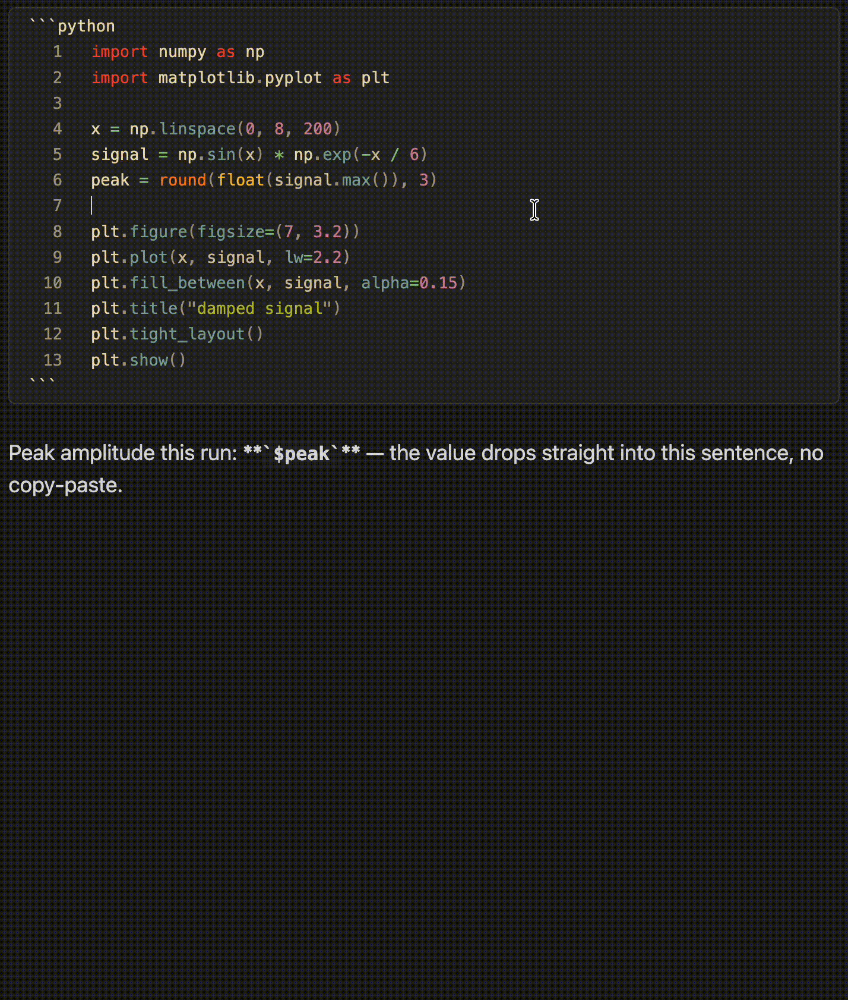

# [CodeSuite](https://community.obsidian.md/plugins/code-suite)

**Execute code inside your notes — a notebook that lives in plain Markdown.**
VS Code–quality syntax highlighting, live code execution with streaming output, shared variables across blocks, inline graphs, and styled HTML/PDF export — all in a plain-text `.md` file you can version, diff, and edit anywhere. No kernel, no `.ipynb`, no server.




---

## At a glance

| | Feature | What it does |
|---|---|---|
| 🎨 | [**Syntax highlighting**](#-highlight) | Shiki (the VS Code engine) — 65+ themes, import any VS Code `.json` theme, in Reading view, Live Preview *and* Source mode |
| ▶️ | [**Live code execution**](#run) | Run Python, JS/TS, Bash, Go, Ruby, PHP, and 8 more — output streams live, with interactive stdin and cancel |
| 📈 | [**Inline graphs**](#run) | `plt.show()` / `fig.show()` render below the block — Matplotlib as images, Plotly as interactive widgets |
| 🔗 | [**Notebook variables**](#notebook-mode) | Shared state across blocks; declare note-wide `vars`; reference any value inline in prose with `` `$varname` `` |
| 📎 | [**Embedded files**](#embed-render) | `![[script.py]]` becomes a collapsible, highlighted, runnable block; open vault code files in a lightweight editor |
| 🔁 | [**Jupyter import/export**](#share) | Convert `.ipynb` notebooks to/from notes — round-trips multi-language blocks correctly |
| 📄 | [**HTML / PDF export**](#share) | Export a note with its code outputs (text, images, plots) to a self-contained, theme-matched file |

---

# 🎨 Highlight

<!-- PLAN: demo-highlighting.gif — switch between Catppuccin, Gruvbox, Nord, Tokyo Night in the theme picker; show code in reading view recoloring live. ~8 s. -->
<!--  -->

Powered by [Shiki](https://shiki.style/) — the exact same engine VS Code uses internally.

- **65+ built-in themes** — Gruvbox, Catppuccin, Dracula, Nord, Tokyo Night, One Dark Pro, Rosé Pine, Kanagawa, Everforest, Solarized, Night Owl, Synthwave '84, and many more
- **Import any VS Code theme** — load a `.json` file from [vscodethemes.com](https://vscodethemes.com) or exported directly from VS Code
- **Auto light/dark switching** — set a separate theme for each mode; CodeSuite switches when Obsidian's appearance changes
- **36+ languages** with common aliases (`py`, `js`, `ts`, `rb`, …)
- **Editor highlighting** — full token colors in Live Preview and Source mode via a CodeMirror 6 ViewPlugin, not just in Reading view
- **Full chrome in Live Preview** — code blocks and `![[file.py]]` embeds render with the same header, Run/Copy buttons, live output, line numbers, and collapse as Reading view. The block your cursor is in reveals its raw source for editing; every other block shows the rendered chrome, with running output preserved as you move around

---

<a id="run"></a>

# ▶️ Run

<!-- PLAN: demo-execution.gif — run a short Python script; output streams live line-by-line; a matplotlib plot appears below; then a second block reads a variable from the first. ~12 s. -->
<!--  -->

Run code directly from a code block — no terminal, no switching apps.

| Language | Command | Notes |
|---|---|---|
| Python | `python3` | Matplotlib & Plotly graph capture, venv support |
| JavaScript | `node` | |
| TypeScript | `npx tsx` | |
| Bash | `bash` | Shared variable state across blocks |
| Zsh | `zsh` | Shared variable state across blocks |
| Shell | `sh` (POSIX) | `shell` and `sh` fences both run POSIX sh; source-file startup support |
| PowerShell | `pwsh` | macOS/Linux/Windows when PowerShell 7+ is installed |
| Go | `go run` | |
| Ruby | `ruby` | |
| Lua | `lua` | |
| Perl | `perl` | |
| R | `Rscript` | |
| PHP | `php` | Automatically prepends `<?php` for snippets that omit the opening tag |
| Swift | `swift` | |

- **Live streaming** — stdout and stderr appear as the process runs, not after it finishes
- **Interactive stdin** — an input bar appears automatically when your code calls `input()` or reads from stdin
- **Password masking** — `sudo` is detected automatically; the input bar masks characters for sensitive prompts
- **Inline graphs** — `plt.show()` and `fig.show()` are intercepted without a display server. Matplotlib figures render as static images; Plotly figures render as interactive HTML widgets (zoom, pan, hover, legend toggles). Click a plot for full-screen view; hover an image for copy/download buttons. Toggle interactivity and offline Plotly.js embedding in settings. By default plots use Matplotlib's own look — to theme every plot (e.g. to match a dark vault), set **Settings → Python → Matplotlib style** to a built-in style name such as `dark_background` or `seaborn-v0_8-darkgrid`, or an absolute path to a `.mplstyle` file

<details>
<summary><b>More execution options</b> — venv, PHP snippets, shells, interpreter paths</summary>

- **Virtual environment support** — point the Python path to a venv binary; CodeSuite sets `VIRTUAL_ENV` and prepends `bin/` to `PATH` so all venv packages are available across every language block
- **PHP snippet mode** — PHP blocks can omit the opening `<?php` tag; CodeSuite adds it only to the temporary execution file
- **Shell startup support** — Bash/Zsh can run as login shells, and Bash/Zsh/Shell blocks can source one or more startup files before your snippet runs
- **Explicit interpreter paths** — pin exact binaries for bash, zsh, and sh/shell under Settings → Environment; useful if Obsidian's PATH differs from your terminal's, or to point `shell` blocks at a modern bash
- **Environment management** — combine a shared `.env` file with per-vault overrides, source shell startup files, run Bash/Zsh as a login shell, or pin exact interpreter paths

</details>

<a id="notebook-mode"></a>

## 🔗 Notebook mode: shared variables & Run All

<!-- PLAN: demo-notebook.gif — define a variable in a vars block, run two Python blocks that reference it, show `$varname` updating inline in the note text, then click Run All. ~15 s. -->
<!--  -->

Each note maintains an in-memory execution session — notebook-style shared state, scoped per note and held in memory.

- **Shared state across blocks** — variables, imports, and function definitions carry over between runs (Python, Bash, and Zsh)
- **Live cross-language variables** — a shared variable changed by one block is visible to later blocks in *any* language, in execution order. Set `count = 42` in Python and a later Bash block sees `42`; change it in Bash and the next Python block sees the new value. Scalars and JSON structures cross languages; rich objects (functions, DataFrames) stay within their language. See [Variable typing & the execution model](https://github.com/felixleopold/obsidian-code-suite/blob/main/docs/configuration.md#variable-typing).
- **Inline `$varname` substitution** — write `` `$result` `` anywhere in your note; it updates live in Reading view after each run
- **Run All** — runs every executable block top-to-bottom, stopping on the first error; the view scrolls along and highlights the executing block. Skip a block with a `skip` fence tag or a `codesuite:skip` comment marker
- **Queued runs** — with shared context on, clicking Run on several blocks queues them in click order; a queued block's button shows **Queued** (click again to cancel)
- **Clear Session** / **Copy output** — reset accumulated state or copy any successful run's output from the note header

<details>
<summary><b><code>vars</code> blocks & <code>code_vars:</code> frontmatter</b> — typed, note-scoped variables</summary>

**`vars` blocks** declare note-scoped variables once; they are injected into every run as **native, correctly-typed literals**:

````
```vars
threshold = 0.85          # float
crawl_depth = 5           # int
download_assets = True    # bool
base_url = "https://x"    # string (one layer of quotes stripped)
dataset = sales_q4.csv    # bare text is a string too
```
````

Types are inferred from how each value is written, so in Python `crawl_depth` is an `int`, `download_assets` is a `bool`, and `base_url` is a clean string.

**`code_vars:` frontmatter** declares the same variables in YAML when you prefer note metadata over a fenced block:

```yaml
---
code_vars:
  threshold: 0.85
  dataset: sales_q4.csv
---
```

You can also write it as a list of `key = value` strings (`- threshold = 0.85`); use that form when you want `code_vars` to render in reading view, since a nested mapping shows an "unsupported property type" warning in Obsidian's Properties panel.

A `vars` block in the body wins if both define the same key.

</details>

State is per-note, lives only in memory, and resets when Obsidian is closed. For the full details on variable types, `:type` hints, multiline strings, cross-language propagation, and the execution model, see **[docs/variables-and-execution.md](https://github.com/felixleopold/obsidian-code-suite/blob/main/docs/variables-and-execution.md)**.

---

<a id="embed-render"></a>

# 📎 Embed & render

<!-- PLAN: demo-embed.gif — type ![[script.py]] in a note, switch to reading view, show the collapsible block appear with filename + line count, then expand it. ~8 s. -->
<!--  -->

**Embedded code files** — embed any code file from your vault with `![[file.py]]` and get a full syntax-highlighted, interactive block instead of plain text:

- **Collapsible by default** — header shows the filename and line count; click to expand
- Supports Run, Copy, and all execution features just like inline blocks
- Inline blocks can also be made collapsible from settings — useful for long preludes you only want to skim

**Vault code files & external aliases** — enable **Settings → CodeSuite → Show code files in the file explorer** (on by default) and Obsidian surfaces every supported code extension (`.py`, `.js`, `.ts`, `.sh`, `.go`, `.rb`, …) in the file explorer:

- Syntax-highlighted **preview** mode (Shiki, same theme as your code blocks)
- Switch to **edit** mode for a lightweight in-vault editor (2-space tab insertion, autosave)
- A **Run** button for any executable language with live streaming output and Cancel support
- **Import code file as alias…** (command palette) symlinks an external file into your vault under **Imports folder** (default `CodeSuiteImports/`) — edits write through to the real file on disk

<details>
<summary><b>HTML live preview</b> — render <code>html</code> blocks as live HTML in a sandboxed iframe</summary>

Render an `html` code block as live HTML instead of showing its source.

````markdown
```html preview
<div style="padding:8px;border-radius:6px;background:#83a598;color:#1d2021">
  Rendered inline ✨
</div>
```
````

- **Per-block flags** on the fence info string: `preview` (or `render`) forces live preview; `source` (or `raw` / `code`) forces the source view
- **Global default** — toggle **Render HTML blocks** in settings to preview every `html` block automatically
- **Preview/Code toggle** — eligible blocks get a header pill to flip between rendered output and source
- **Embedded `.html` files** — pass the flag in the embed alias: `![[page.html|preview]]` or `![[page.html|source]]`
- **Full documents** — `<head>`, `<style>`, and `<script>` all work; a `<!DOCTYPE html>` page renders as-is, a bare fragment inherits your Obsidian theme

> The HTML renders in a **sandboxed iframe** (`sandbox="allow-scripts"`, no same-origin). Scripts run and styles apply, but only inside the frame — they **cannot** reach your vault, the rest of the app, or Obsidian's API.

**Export a block to PDF (invoices, reports, certificates)** — turn on **PDF export for HTML blocks** in settings and rendered `html` blocks get a **PDF** pill that opens a menu:

- **Save as PDF…** — renders just that block on an A4 page and saves it next to the note (`<note name>.pdf`), ideal for archiving an invoice into its folder
- **Print…** — opens the system print dialog for the block alone

Both honour the block's own CSS, including `@media print` rules, and lay it out on A4 with comfortable margins. Opt a single block in or out with a `pdf` (or `nopdf`) fence flag — `pdf` alone also renders the block — so you don't need the global setting on:

````markdown
```html pdf
<div class="invoice">…</div>
```
````

Desktop only (both paths need Electron).

</details>

---

<a id="share"></a>

# 🔁 Share: import & export

<!-- PLAN: demo-export.gif — Run All on a notebook-style note, then export to PDF; show the resulting PDF with code outputs and plots, theme-matched. The differentiator shot. ~10 s. -->
<!--  -->

Move work between CodeSuite and the Jupyter ecosystem, or share a polished copy of a note. All four commands live in the command palette (desktop only).

**Jupyter notebooks (`.ipynb`)**

- **Import Jupyter notebook (.ipynb)…** — code cells become fenced code blocks in the notebook's language; markdown cells become note prose. Notebooks import **unrun** so you re-run blocks in CodeSuite.
- **Export note to Jupyter notebook (.ipynb)** — every executable block becomes a code cell; blocks in a non-dominant language carry a `metadata.vscode.languageId` tag so VS Code renders each cell in the right language and the notebook round-trips correctly on re-import. Cells export **without** outputs.

**Styled HTML & PDF (with outputs)**

- **Export note to HTML (with outputs)**
- **Export note to PDF (with outputs)** (rendered via Electron's print engine)

Both produce a self-contained file that matches what you see in Obsidian — same Shiki theme, CodeSuite styling, and **code outputs** (text, images, plots). Each export opens a small **options dialog** (last choices remembered):

- **Content width** (HTML + PDF) — *Obsidian default*, *Match current view*, or *Full width*
- **Keep code blocks together** (PDF) — avoid splitting a block across a page break
- **Single long page** (PDF) — one continuous page with no page breaks

> **Outputs come from the live render.** Open the note in **reading view** and run the blocks you want shown (individually or with **Run All**), *then* export. Whatever output is on screen is captured as-is; nothing is written back into your `.md`. If the note isn't in reading view, the command is unavailable.

**Bake outputs into the note (for sharing)** *(advanced — off by default)*

HTML/PDF export produces a *separate* file. **Baking** instead writes the output **into the note's markdown**, so it survives anywhere the raw `.md` is read — most importantly in **shared notes** (e.g. via NoteColab), where the recipient opens the note in a web viewer that has no CodeSuite to re-run your code. Without baking, a shared note shows your code but no output.

Enable it under **Settings → CodeSuite → Sharing (baked outputs)**. Most users never need this; leaving it off changes nothing. Once on, two commands appear:

- **Bake code outputs into note (for sharing)** — for every code block you've run, serializes its current output into a hidden ` ```codesuite-output ` block placed right after it. Run your blocks first, then bake.
- **Clear baked outputs from note** — removes every baked block and its figure files. Fully reversible.

CodeSuite renders baked blocks as normal output panels (reading view **and** live preview); other markdown renderers fall back to a labelled code block. Two things are handled deliberately:

- **No note bloat** — figures (e.g. matplotlib plots) are written as image **files** in a configurable folder (default `CodeSuite/baked-outputs`) and referenced by name, not inlined as base64. A *Inline images instead of files* toggle is available if you'd rather keep the note self-contained at the cost of size. (Interactive Plotly widgets have no static image form, so they're always inlined.)
- **No stale media** — figure filenames embed a hash of their source code, so re-baking after an edit writes fresh files and the old ones are swept automatically. The baked panel also shows a **`stale`** badge when the code above it has changed since the output was baked — re-run and re-bake to refresh.

---

## Installation

**Community Plugins** *(recommended)* — Settings → Community Plugins → Browse → search **CodeSuite** → Install → Enable.

<details>
<summary><b>Manual install</b></summary>

1. Download `main.js`, `manifest.json`, and `styles.css` from the [latest release](https://github.com/felixleopold/obsidian-code-suite/releases)
2. Create `<vault>/.obsidian/plugins/code-suite/`
3. Place the three files inside it
4. Reload Obsidian and enable **CodeSuite** in **Settings → Community Plugins**

</details>

## Configuration

Open **Settings → CodeSuite** to configure themes, code execution, environment variables, and embedded file behaviour.

| | |
|---|---|
| [Variables & Execution](https://github.com/felixleopold/obsidian-code-suite/blob/main/docs/variables-and-execution.md) | How to run code, declare variables, use `$varname`, cross-language propagation, practical patterns |
| [Configuration Reference](https://github.com/felixleopold/obsidian-code-suite/blob/main/docs/configuration.md) | Every setting, option, and environment knob |

---

<details>
<summary><b>Known limitations</b></summary>

**Active-line highlight bleeds into code blocks (editor mode)** — when the cursor is inside a code block in Live Preview or Source mode, Obsidian's active-line highlight shows through the block background. This is inherent to how Obsidian's active-line extension works.

**Workaround:** Enable **Auto-switch theme** and choose a theme whose background matches Obsidian's active-line color — the bleed becomes invisible.

</details>

<details>
<summary><b>Roadmap & changelog</b></summary>

Track progress or vote on the linked GitHub issues.

| # | Feature | Issue |
|---|---------|-------|
| 1 | **Per-block code formatting** — line highlighting `{1,5-10}`, diff highlighting `ins`/`del`, per-block titles, `showLineNumbers` override, and inline code syntax highlighting | [#13](https://github.com/felixleopold/obsidian-code-suite/issues/13) |

**Recent releases**

- **1.11.0** — PDF export for HTML blocks: rendered `html` blocks get a **PDF** pill to save or print just that block on an A4 page (great for invoices and reports). Opt in globally with **PDF export for HTML blocks**, or per block with a `pdf` / `nopdf` fence flag.
- **1.9.3** — execution and output-panel fixes: re-running a block after Run All no longer throws a `NameError`, the spurious trailing blank line in output is gone, and output-less runs collapse to a slim `Output (none)` header. New: clicking Run All again while it runs cancels the pass.
- **1.9.2** — README and listing overhaul: a hero demo GIF, a feature "At a glance" table, the four feature pillars (Highlight / Run / Embed / Share), and a rewritten store description. No functional changes.
- **1.9.1** — lint compliance: replaced banned `obsidianmd/ui/sentence-case` rule disables with an `ignoreRegex` allowlist, removed a CSS `!important` in favor of higher selector specificity.
- **1.9.0** — multi-language Jupyter export ([#5](https://github.com/felixleopold/obsidian-code-suite/issues/5)): every executable block becomes a code cell; non-dominant blocks carry `metadata.vscode.languageId` so VS Code renders and round-trips them. Quality: cancellation polish, skip-badge alignment by code hash, fence-attribute isolation, Matplotlib style default corrected.
- **1.8.0** — interactive Plotly widgets and click-to-expand plots ([#12](https://github.com/felixleopold/obsidian-code-suite/issues/12)); Jupyter `.ipynb` import/export and styled HTML/PDF export with outputs ([#5](https://github.com/felixleopold/obsidian-code-suite/issues/5)); HTML live preview in a sandboxed iframe.
- **1.7.0** — full code-block chrome in Live Preview: header, Run/Copy, live output, line numbers, collapse, and `![[file.py]]` embeds.
- **1.6.0** — typed `vars`/`code_vars` injection with `:type` hints and multiline strings ([#16](https://github.com/felixleopold/obsidian-code-suite/issues/16)), live cross-language variable propagation, experimental data tables.
- **1.5.2** — soft-wrap long lines in reading view ([#22](https://github.com/felixleopold/obsidian-code-suite/issues/22)), optional clear-session button ([#23](https://github.com/felixleopold/obsidian-code-suite/issues/23)).
- **1.5.0** — explicit interpreter paths for bash/zsh/sh ([#20](https://github.com/felixleopold/obsidian-code-suite/issues/20)), `sh` fence now runs POSIX sh.
- **1.4.0** — PHP support, PowerShell support, shell startup files, login-shell mode, Zsh-native variable snapshotter.
- **1.3.0** — code files in the file explorer, copy-output button, collapsible inline blocks, `.env` file support, `codesuite:skip`, `code_vars:` frontmatter, in-vault code editor, import-as-alias command.

</details>

## Contributing

Found a bug or have a feature request? [Open an issue on GitHub](https://github.com/felixleopold/obsidian-code-suite/issues). Want to contribute code? See [CONTRIBUTING.md](CONTRIBUTING.md).

## Credits & license

- [Shiki](https://shiki.style/) — syntax highlighting engine (MIT)
- [Obsidian](https://obsidian.md/) — the app this plugin is built for
- [CodeMirror 6](https://codemirror.net/) — editor framework used by Obsidian

[Apache 2.0](LICENSE) © Felix Leopold
