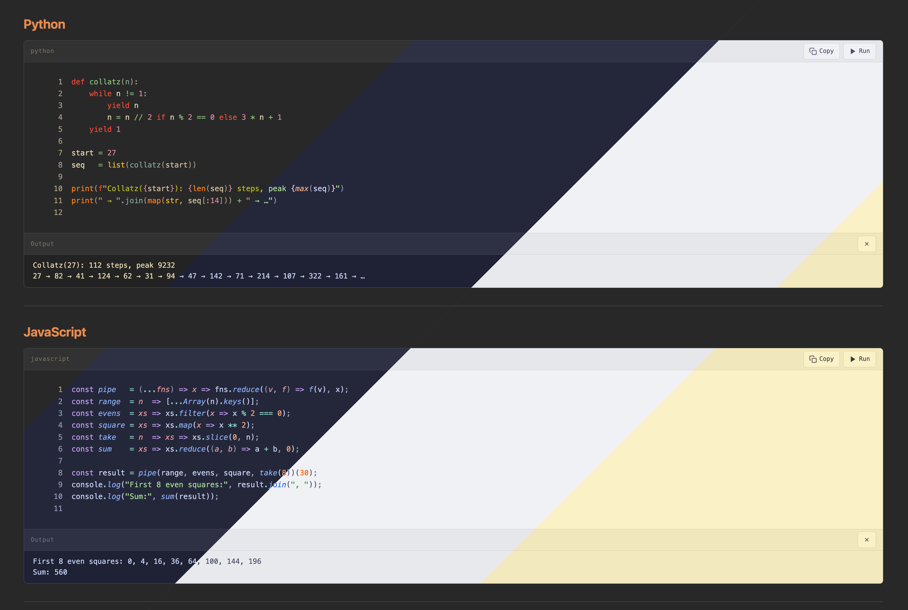

# [CodeSuite](https://community.obsidian.md/plugins/code-suite)

**Think Jupyter Notebook, but inside your Obsidian vault. VS Code–quality syntax highlighting, live code execution with streaming I/O, shared variables across blocks, and inline graph rendering — with zero extra infrastructure.**



---

## Features

- **Shiki syntax highlighting** — 65+ built-in themes, import any VS Code `.json` theme, auto light/dark switching, full color in Reading view *and* the editor
- **Live code execution** — Python, JS/TS, Bash, Go, Ruby, and more; output streams character-by-character; interactive stdin, password masking, cancel mid-run
- **Inline graphs** — `plt.show()` and `fig.show()` are intercepted; Matplotlib and Plotly render below the block without a display server
- **Notebook mode** — shared execution context across blocks, `vars` blocks, inline `` `$varname` `` substitution, **Run All** and **Clear Session**
- **Embedded code files** — `![[script.py]]` renders as a collapsible, syntax-highlighted, executable block

---

## Syntax Highlighting

<!-- GIF: Switch between several themes (Catppuccin, Gruvbox, Nord, Tokyo Night) in the theme picker — show code updating in reading view in real time. ~8 s. Save as assets/demo-highlighting.gif -->
<!--  -->

Powered by [Shiki](https://shiki.style/) — the exact same engine VS Code uses internally.

- **65+ built-in themes** — Gruvbox, Catppuccin, Dracula, Nord, Tokyo Night, One Dark Pro, Rosé Pine, Kanagawa, Everforest, Solarized, Night Owl, Synthwave '84, and many more
- **Import any VS Code theme** — load a `.json` file from [vscodethemes.com](https://vscodethemes.com) or exported directly from VS Code
- **Auto light/dark switching** — set a separate theme for each mode; CodeSuite switches when Obsidian's appearance changes
- **36+ languages** with common aliases (`py`, `js`, `ts`, `sh`, `rb`, …)
- **Editor highlighting** — full token colors in Live Preview and Source mode via a CodeMirror 6 ViewPlugin, not just in Reading view

---

## Code Execution

<!-- GIF: Run a short Python script; show output streaming live line-by-line, then a second block reading a variable defined in the first. ~12 s. Save as assets/demo-execution.gif -->
<!--  -->

Run code directly from a code block — no terminal, no switching apps.

**Supported runtimes:**

| Language | Command | Notes |
|---|---|---|
| Python | `python3` | Matplotlib & Plotly graph capture, venv support |
| JavaScript | `node` | |
| TypeScript | `npx tsx` | |
| Bash | `bash` | Shared variable state across blocks |
| Zsh | `zsh` | Shared variable state across blocks |
| Shell | `sh` | |
| Go | `go run` | |
| Ruby | `ruby` | |
| Lua | `lua` | |
| Perl | `perl` | |
| R | `Rscript` | |
| PHP | `php` | |
| Swift | `swift` | |

- **Live streaming** — stdout and stderr appear as the process runs, not after it finishes
- **Interactive stdin** — an input bar appears automatically when your code calls `input()` or reads from stdin
- **Password masking** — `sudo` is detected automatically; the input bar masks characters for sensitive prompts
- **Inline graphs** — `plt.show()` and `fig.show()` are intercepted; graphs render as inline images without a display server
- **Virtual environment support** — point the Python path to a venv binary; CodeSuite sets `VIRTUAL_ENV` and prepends `bin/` to `PATH` so all venv packages are available across every language block

---

## Notebook Mode: Shared Variables & Run All

<!-- GIF: Define a variable in a vars block, run two Python blocks that reference it, show `$varname` updating inline in the note text, then click Run All. ~15 s. Save as assets/demo-notebook.gif -->
<!--  -->

Each note maintains an in-memory execution session — the closest thing to a Jupyter notebook inside Obsidian, without a kernel daemon or `.ipynb` file.

- **Shared state across blocks** — variables, imports, and function definitions carry over between runs (Python and Bash)
- **`vars` blocks** — declare note-scoped variables once; they are injected into every run:
  ````
  ```vars
  threshold = 0.85
  dataset = "sales_q4.csv"
  ```
  ````
- **Inline `$varname` substitution** — write `` `$result` `` anywhere in your note; it updates live in Reading view after each run
- **Run All** — runs every executable block top-to-bottom in sequence, stopping on the first error
- **Clear Session** — reset all accumulated state from the note header button

State is per-note, lives only in memory, and resets when Obsidian is closed.

---

## Embedded Code Files

<!-- GIF: Type ![[script.py]] in a note, switch to Reading view, show the collapsible block appearing with filename + line count, then expand it. ~8 s. Save as assets/demo-embedded.gif -->
<!--  -->

Embed any code file from your vault with `![[file.py]]` and get a full syntax-highlighted, interactive block instead of plain text.

- **Collapsible by default** — header shows the filename and line count; click to expand
- Supports Run, Copy, and all execution features just like inline blocks

---

## Installation

### Community Plugins *(recommended)*

1. Open **Settings → Community Plugins → Browse**
2. Search for **CodeSuite**
3. Click **Install**, then **Enable**

### Manual

1. Download `main.js`, `manifest.json`, and `styles.css` from the [latest release](https://github.com/felixleopold/obsidian-code-suite/releases)
2. Create `<vault>/.obsidian/plugins/code-suite/`
3. Place the three files inside it
4. Reload Obsidian and enable **CodeSuite** in **Settings → Community Plugins**

---

## Configuration

Open **Settings → CodeSuite** to configure themes, code execution, environment variables, and embedded file behaviour. See the full [configuration reference](docs/configuration.md) for all options.

---

## Known Limitations

### Active-line highlight bleeds into code blocks (editor mode)

When the cursor is inside a code block in Live Preview or Source mode, Obsidian's active-line highlight shows through the block background. This is inherent to how Obsidian's active-line extension works.

**Workaround:** Enable **Auto-switch theme** and choose a theme whose background matches Obsidian's active-line color — the bleed becomes invisible.

---

## Planned Upgrades

The following features are on the roadmap. Track progress or vote on the linked GitHub issues.

| # | Feature | Issue |
|---|---------|-------|
| 1 | **Code files in the file explorer** — register code extensions so `.py`, `.js`, etc. appear in the Obsidian sidebar | [#4](https://github.com/felixleopold/obsidian-code-suite/issues/4) |
| 2 | **Import / export** — round-trip conversion to/from `.ipynb`; export notes as styled HTML and PDF (including outputs) | [#5](https://github.com/felixleopold/obsidian-code-suite/issues/5) |
| 3 | **Copy button for output** — one-click copy of the full output panel text | [#6](https://github.com/felixleopold/obsidian-code-suite/issues/6) |
| 4 | **Collapsible inline code blocks** — collapse/expand toggle in reading view; expanded by default | [#7](https://github.com/felixleopold/obsidian-code-suite/issues/7) |
| 5 | **`.env` file support** — point to a `.env` file instead of defining environment variables in settings | [#8](https://github.com/felixleopold/obsidian-code-suite/issues/8) |
| 6 | **Skip blocks in Run All** — mark individual blocks to be ignored when running the whole note | [#9](https://github.com/felixleopold/obsidian-code-suite/issues/9) |
| 7 | **Variables in YAML frontmatter** — declare shared variables under `code_vars:` in frontmatter, alongside the existing `vars` block syntax | [#10](https://github.com/felixleopold/obsidian-code-suite/issues/10) |
| 8 | **Lite code editor for vault files** — open and edit code files in Obsidian with syntax highlighting, a Run button, and output display | [#11](https://github.com/felixleopold/obsidian-code-suite/issues/11) |
| 9 | **Better plot support** — interactive Plotly graphs (zoom, hover, pan) and a full-screen mode for all plot outputs | [#12](https://github.com/felixleopold/obsidian-code-suite/issues/12) |

---

## Contributing

Found a bug or have a feature request? [Open an issue on GitHub](https://github.com/felixleopold/obsidian-code-suite/issues).

Want to contribute code? See [CONTRIBUTING.md](CONTRIBUTING.md) for setup instructions and conventions.

---

## Credits

- [Shiki](https://shiki.style/) — syntax highlighting engine (MIT)
- [Obsidian](https://obsidian.md/) — the app this plugin is built for
- [CodeMirror 6](https://codemirror.net/) — editor framework used by Obsidian

## License

[Apache 2.0](LICENSE) © Felix Leopold
